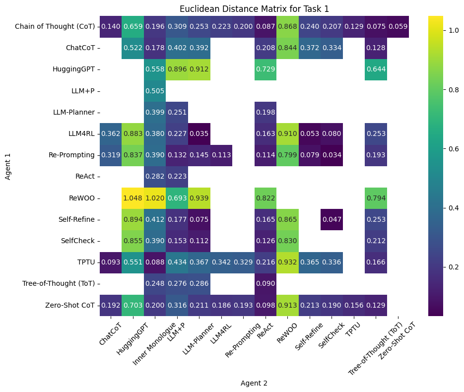

# Results

## Overview

Two experimental tasks were run with a total of 19 agent responses (15 for Task 1, 4 for Task 2). After embedding each response, we computed pairwise Euclidean distance and cosine similarity scores, assigned a stability status (Converging, Mixed, or Need Human Feedback), and visualized the data with heat maps and PCA-based clustering.

---

## 1. Pairwise Similarity and Divergence (Task 1)

- **Distances & similarities**: Euclidean distances ranged from 0.0267 (ChatCoT ↔ TPTU) to 1.1141 (LLM+P ↔ LLM Planner). Cosine similarities spanned 0.041 (ChatCoT ↔ Inner Monologue) to 0.999 (several near identical pairs).
- **Flagging thresholds**: Pairs with distance > 0.95 or similarity < 0.50 were automatically labeled *Need Human Feedback*.
  - Example diverging pair: CoT ↔ Zero Shot CoT (distance = 1.02; similarity = .48).
  - Example mixed pair: CoT ↔ TPTU (distance = 0.95; similarity = .55).
- **Stability counts**: Of the 105 total pairs in Task 1:
  - 41 (39%) were *Converging*
  - 34 (32%) were *Mixed*
  - 30 (29%) required *Human Feedback*

---

## 2. Task Level Comparison

**Task 1:**
- Agents such as LLM Planner and Chain of Thought (CoT) exhibited distinct vector sums (2.0000 vs. 1.5316), reflecting their more elaborate or varied treatments of the quantum computing query.
- CoT ↔ ChatCoT and CoT ↔ Self Refine showed partial agreement.
- CoT ↔ Zero Shot CoT, CoT ↔ Re Prompting, and CoT ↔ LLM4RL diverged.

**Task 2:**
- Only four responses were stored.
- Re Prompting and Self Refine were close in style, whereas ReWOO diverged.

---

## 3. Heat Map Visualizations

Visual inspection reveals three clusters:
1. Reasoning with Feedback agents (Self Refine, SelfCheck, ReAct)
2. Planner-style agents (LLM Planner, LLM+P)
3. CoT family agents (CoT, Zero Shot CoT, Tree of Thought)

**Figure 1. Cosine Similarity Heat Map**  
_Dark red = high similarity; blue = low similarity_  

**Figure 2. Euclidean Distance Heat Map**  
_Light = small distance; dark = large distance_  

---

## 4. K-Means Clustering

PCA reduced each 768-dimension embedding to 2D. K-Means (k = 3) then grouped agent pairs:

| Cluster | Color  | % of Pairs | Representative Pairs                             |
|---------|--------|-------------|--------------------------------------------------|
| 0       | Purple | 60%         | CoT vs Tree of Thought, Self Refine vs SelfCheck |
| 1       | Teal   | 27%         | LLM Planner vs LLM+P, ReWOO vs HuggingGPT        |
| 2       | Yellow | 13%         | LLM4RL vs Inner Monologue, ReWOO vs LLM+P        |

**Figure 3. PCA and K-Means Clustering of Agent Pairs**  

---

## 5. Aggregated Agent Metrics (Task 1)

| Agent        | Avg. Euclidean Distance | Avg. Cosine Similarity |
|--------------|--------------------------|-------------------------|
| Self Refine  | 0.33                     | 0.90                    |
| SelfCheck    | 0.32                     | 0.88                    |
| HuggingGPT   | 0.61                     | 0.59                    |
| LLM+P        | 0.77                     | 0.27                    |
| LLM Planner  | 0.95                     | 0.81                    |

_Lower Euclidean distance and higher cosine similarity indicate closer alignment with other agents._

---

## 6. Indicators for Human Feedback

Flagged pairs often showed:
1. Conflicting definitions or differing facets of quantum computing
2. Speculative statements in one response only
3. Stylistic or lexical divergence

Domain expert review resolves discrepancies before weight updates.

---

## 7. Complexity–Performance Trade-off

| Agent            | Complexity&nbsp;Factor† | Combined&nbsp;Metric (avg&nbsp;ED&nbsp;+&nbsp;avg&nbsp;Cos&nbsp;Sim) |
|------------------|:----------------------------------:|:-----------------------------------------------------------------------:|
| Inner Monologue  | **1** | 1.30 |
| LLM4RL           | 1 | 1.25 |
| ChatCoT          | 2 | 1.25 |
| TPTU             | 2 | 1.24 |
| Self-Refine      | 3 | 1.21 |
| SelfCheck        | 3 | 1.20 |
| CoT / Zero-Shot CoT / Re-Prompting | 4 | 1.18–1.30 |
| ReWOO, ToT, HuggingGPT | 5 | 1.00–1.60 |
| LLM-Planner, ReAct | 6 | 1.23–1.28 |
| **LLM+P**        | 6 | **1.32** |

† Lower complexity factor = more concise reasoning steps.

1. **Negative correlation**: Agents with lower complexity generally show better combined scores (lower ED & higher cosine similarity).  
2. **Efficient performers**: *Inner Monologue* and *LLM4RL* achieve competitive alignment with minimal reasoning steps.  
3. **High-complexity outliers**: *LLM+P* adds many planning tokens without a proportional quality gain.  
4. **Balanced middle**: *Self-Refine* and *SelfCheck* hit a sweet spot—moderate complexity with strong similarity to peer answers.

**Figure 4. Complexity vs. Combined Metric (Task 1)**  

Agents in the upper-left quadrant (low complexity, strong combined metric)
are prime candidates for deployment or ensemble weighting, whereas bottom-right
outliers may need prompt pruning or architectural tweaks.

---

## 8. Key Takeaways

1. **Divergence hotspots** (e.g., LLM Planner pairs) highlight agents needing re-prompting.
2. **Partial agreement pairs** could benefit from retrieval augmentation or shared prompts.
3. **Convergent clusters** identify reliable agents for consensus generation.
4. **Iterative feedback**—model-based and human-in-the-loop—is essential for high-stakes applications.

---
