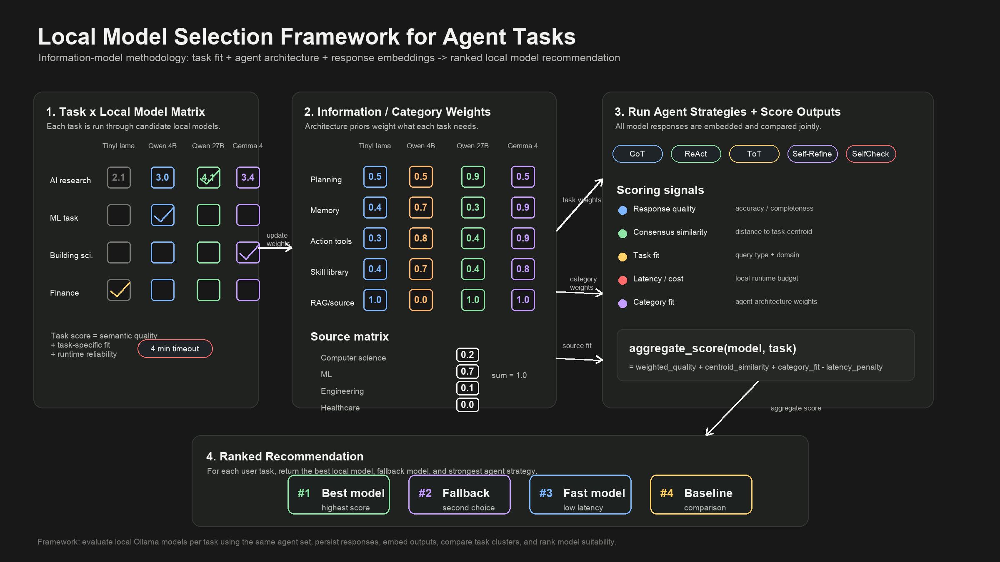

# Local LLM Comparison for Energy-Efficient Agent Routing

A framework for comparing **local** large language models (LLMs) and routing each task to the model that does the job well *at the lowest power cost* — favoring the leanest capable model so you save energy and keep all data on-device.

Each candidate model runs under structured agent strategies (planning, memory, action, profiling, library); responses are stored and embedded, then compared by task cluster, cross-model consensus, task/category fit, and runtime/energy constraints. It combines agent generation, response storage, planning categorization, and vector-based evaluation using FAISS, PCA, and KMeans clustering — implemented and tested against local Ollama models (originally on a TinyLLaMA server).

> **Lineage:** evolved from an earlier multi-agent *hallucination-reduction* study — the same triangulation and weight-updating machinery now drives **power-aware model selection** instead of hallucination scoring.

📘 For a detailed visual walkthrough, check out the full Canva presentation here:  
- [Canva Link](https://www.canva.com/design/DAGjtP7hnFw/JUAe152lLyDQ9HO9pAIOqg/edit?utm_content=DAGjtP7hnFw&utm_campaign=designshare&utm_medium=link2&utm_source=sharebutton)

---
## 📚 Table of Contents

- [Introduction](https://github.com/GauraangMalikk/Information-Model-an-LLM-Agent-Architecture/blob/main/GIT%20REPOSITORY/LLM%20%2B%20Agent/paper/intro.md)
- [Methods](https://github.com/GauraangMalikk/Information-Model-an-LLM-Agent-Architecture/blob/main/GIT%20REPOSITORY/LLM%20%2B%20Agent/methods/methods.md)
- [Results](https://github.com/GauraangMalikk/Information-Model-an-LLM-Agent-Architecture/blob/main/GIT%20REPOSITORY/LLM%20%2B%20Agent/results/results.md)
- [Literature Review](https://github.com/GauraangMalikk/Information-Model-an-LLM-Agent-Architecture/blob/main/GIT%20REPOSITORY/LLM%20%2B%20Agent/lit_review/literature_review.md)
- [Future Work](https://github.com/GauraangMalikk/Information-Model-an-LLM-Agent-Architecture/blob/main/GIT%20REPOSITORY/LLM%20%2B%20Agent/future_work/future_work.md)

---

## ✅ Overview

This project explores hallucination mitigation in LLMs by:
- Building a **planning-aware agent architecture** Future work - profiling, memory, tools, and action components
- Storing and indexing responses using **semantic vector search (FAISS)**
- Classifying agent strategies using a **planning taxonomy**
- Measuring response stability and alignment via **embedding-based pairwise analysis**
- Clustering performance using **PCA + KMeans**
- Evaluating complexity vs. performance tradeoffs for each agent

---

## 🧱 Architecture (Blocks A–H)

| Block | Description |
|-------|-------------|
| **A** | LLM setup, calling multiple planning agent, storing agent responses in a vector Database (FAISS), setting up structred database and semantic search system for agent evaluation |
| **B** | Multi-agent response evaluation using cosine & euclidean distances, response length, completion time as features/metrics |
| **C** | PCA-reduced Vector database and pairwise score analysis - interpretable evaluation though principles of triangulation |  
| **D** | Heatmaps of pairwise agent similarity |
| **E** | Per-agent aggregated metrics across tasks |
| **F** | KMeans clustering of agent pair performance |
| **G** | Planning taxonomy–aware clustering |
| **H** | Complexity-based agent ranking |

Each block is modular and reproducible.

### 📊 Figure – Energy-Efficient Agent Routing


*Energy-efficient agent routing — local models (Gemma, Llama, DeepSeek, Qwen3) are scored across task, category, and library/RAG matrices. Weights update from feedback (±0.1) and triangulation; the per-task total selects the best model while favoring the leanest / lowest-power one that still converges with the others.*
[Click here to know more](https://github.com/GauraangMalikk/Information-Model-an-LLM-Agent-Architecture/blob/main/GIT%20REPOSITORY/LLM%20%2B%20Agent/methods/methods.md)

---

## ⚙️ Setup & Usage

### 1. Clone this repo

```bash
git clone https://github.com/GauraangMalikk/Information-Model-an-LLM-Agent-Architecture.git
cd Information-Model-an-LLM-Agent-Architecture
```

---

## Local Model Selection Framework

This update extends the project into a local multi-model evaluation framework for checking which local LLM is best suited for a task under different agent architectures.

The workflow runs the same task set through multiple agent strategies and local Ollama models, stores responses, embeds them into a shared semantic space, and compares model behavior by task cluster, consensus, task/category fit, and runtime constraints.



The framework combines:

- **Task matrix**: task/domain examples tested against local model candidates.
- **Agent architecture matrix**: planning, memory, action tools, skill libraries, and source/RAG coverage.
- **Response evaluation**: semantic embeddings, centroid similarity, response quality, task fit, and latency/cost.
- **Recommendation output**: ranked best local model, fallback model, and strongest agent strategy for the task.

### Current Artifacts

- `agents4pfinal.ipynb` — main notebook for running agents, storing responses, and generating analysis.
- `agents.csv` — agent architecture metadata.
- `tasks.csv` — task set used for model/agent comparison.
- `results/` — generated CSVs and visual analysis outputs.
- `docs/local_model_selection_framework.png` — methodology diagram.

### Live Demo

[MultiAgent LLM Response Space Explorer](https://huggingface.co/spaces/gauraang/MultiAgent)

### Privacy Note

Local secrets and runtime files are intentionally excluded through `.gitignore`, including `.env`, virtual environments, logs, local database files, and embedded third-party Git repositories.
